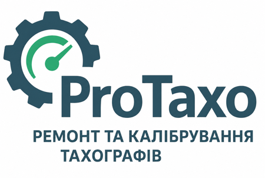

<div align="center">
  

  # ProTaxo ERP

  Внутрішня система управління сервісним центром з калібрування тахографів і ремонту вантажного транспорту.
</div>

---

## Що це

ProTaxo — ERP-система для тахосервісу: облік наряд-заказів, договорів, каталогу товарів і послуг, контрагентів, автопарку та тахографів, а також повноцінний модуль протоколів калібрування тахографів за офіційним бланком.

Розроблено з нуля — від бізнес-логіки до продакшн-інфраструктури — і розгорнуто в реальному використанні на власному сервері.

## Можливості

- **Наряд-заказ** — документ продажу товарів/послуг з автоматичним розрахунком вартості, списанням зі складу, генерацією PDF (наряд, рахунок на оплату з розбивкою ПДВ, акт виконаних робіт)
- **Протокол калібрування тахографа** — повний офіційний бланк (11 пунктів, таблиця результатів на 13 рядків), прив'язка до наряд-заказу й реального тахографа контрагента, автогенерація PDF
- **Наклейки з QR-кодом** — окремий Print Agent друкує наклейку на термопринтері (TSPL); QR веде на публічну сторінку перевірки протоколу, доступну будь-кому без входу в систему (через Tailscale Funnel)
- **Довідники**: контрагенти, автомобілі, водії, тахографи, каталог товарів і послуг, договори
- **Рольова модель доступу** (ADMIN/MASTER) із гнучкими правами на рівні окремих дій та повним журналом аудиту (хто/коли/що саме змінив)
- **Керування користувачами** — запрошення поштою, самостійна зміна пароля, відновлення забутого пароля, відстеження останнього входу

## Технологічний стек

| Категорія | Технології |
|---|---|
| Бекенд | Java 21, Spring Boot 4, Spring Security, Spring Data JPA / Hibernate, Spring WebSocket |
| База даних | PostgreSQL 16, Flyway (усі зміни схеми — лише через міграції) |
| Веб-шар | Thymeleaf (серверний рендеринг), без фронтенд-фреймворків |
| PDF | openhtmltopdf |
| Друк наклейок | TSPL2, `javax.print`, окремий легкий Java-клієнт (Print Agent) |
| Інфраструктура | Docker / Docker Compose, Caddy (реверс-проксі), Tailscale VPN + Funnel |

Повний і актуальний опис — [`docs/Технологічний стек.md`](docs/Технологічний%20стек.md).

## Архітектура розгортання

Продакшн живе в приватній мережі — доступ лише через Tailscale VPN, без жодного відкритого назовні порту застосунку чи бази даних. Єдиний навмисний виняток — вузький публічний вхід для сканування QR-коду на наклейці калібрування (через Tailscale Funnel), не пов'язаний з рештою системи.

Деталі — [`docs/Варіанти розгортання (сервер).md`](<docs/Варіанти розгортання (сервер).md>).

## Швидкий старт (локальна розробка)

```bash
# 1. Підняти базу даних і MailHog (перехоплювач листів для локальної розробки)
docker compose up -d

# 2. Запустити застосунок
./mvnw spring-boot:run
```

Відкрити `http://localhost:8080` — редірект на сторінку входу. Тестові акаунти (засіваються автоматично при першому старті):

| Email | Пароль | Роль |
|---|---|---|
| `admin@protaxo.local` | `admin123` | ADMIN |
| `master@protaxo.local` | `master123` | MASTER |

> Це дефолтні паролі лише для локальної розробки. На реальному продакшн-сервері вони змінені на випадкові.

## Документація

Повна база знань проєкту — у теці [`docs/`](docs/) (Obsidian vault, взаємопов'язані нотатки по кожному модулю): архітектурні рішення, історія багів і виправлень, деталі розгортання, тестування. Стартова точка — [`docs/Home.md`](docs/Home.md).

## Структура коду

Вертикальні зрізи по модулях (не по шарах) — кожен модуль (`client`, `vehicle`, `invoice`, `catalog`, `security`, `calibration`, `printagent`...) має власні `entity/ dto/ mapper/ repository/ service/ controller/ web/`.

---

<div align="center">Приватний проєкт. Не для публічного використання.</div>
